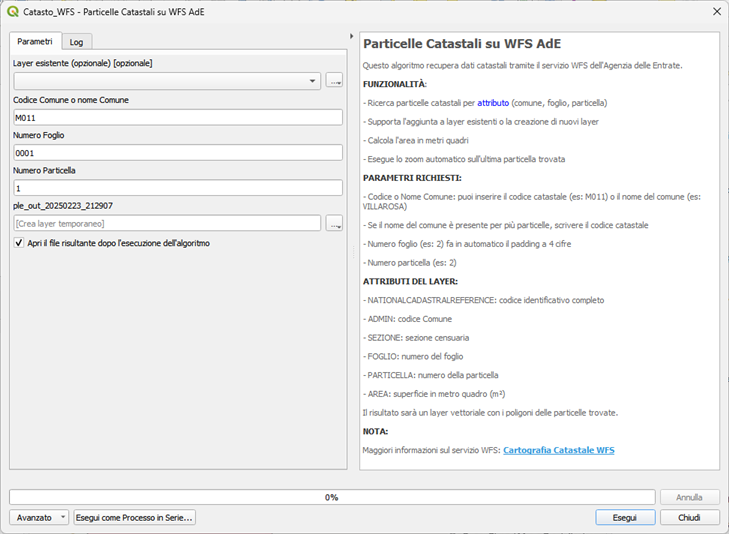

# Tool per QGIS: Estrazione di Particelle Catastali tramite Ricerca per Attributo e WFS

Questo tool è progettato per essere integrato in QGIS e consente di scaricare le particelle catastali tramite una _**ricerca per attributo**_, sfruttando il servizio WFS (Web Feature Service) fornito dal Catasto AdE e il [servizio di _query_](https://github.com/ondata/dati_catastali) realizzato da onData.

### Ricerca e download di particelle DEMO

**FUNZIONALITÀ**:
- Ricerca particelle catastali per attributo (comune, foglio, particella)
- Supporta l'aggiunta a layer esistenti o la creazione di nuovi layer
- Calcola l'area della particella in metri quadri
- Esegue lo zoom automatico sull'ultima particella trovata

**PARAMETRI RICHIESTI:**
- Codice o Nome Comune: puoi inserire il codice catastale (es: M011) o il nome del comune (es: VILLAROSA)
- Se cercate più volte la stessa particella non la inserisce
- Se il nome del comune è presente per più particelle chiede di scrivere il codice catastale
- Numero foglio (es: 2) fa il padding a 4 cifre
- Numero particella:
  - Particella singola: "1"
  - Lista particelle: "1,2,3,45"
  - Intervallo particelle: "1-7" (scarica tutte dalla 1 alla 7)
  - Combinazioni: "1,3,5-8,10,15-20"

<b>NOTA</b>:
    Se viene richiesta la modalità "scarica tutte le particelle", e il numero di particelle del foglio è molto elevato,
    viene mostrato un avviso per segnalare l'operazione potenzialmente lenta.

**ATTRIBUTI DEL LAYER:**
- **_NATIONALCADASTRALREFERENCE_**: codice identificativo completo
- _**ADMIN**_: codice comune
- **_SEZIONE_**: sezione censuaria
- _**FOGLIO**_: numero del foglio
- _**PARTICELLA**_: numero della particella
- _**AREA**_: superficie in metri quadrati (m²)

Il risultato sarà un layer vettoriale con i poligoni delle particelle trovate.

### Le API che permettono la ricerca

- [Query engine](./reference/query_engine.md) a cura dell'associazione [onData](https://ondata.substack.com/)

### Come installare l'algoritmo nel Processing di QGIS

- L'algoritmo funziona solo da Processing di QGIS;
- Vai su Strumenti di Processing
- `Aggiungi Script agli Strumenti...` dopo aver cliccato sull'Icona di Python :

- Troverai l'algoritmo nel Gruppo Script | Catasto_WFS | Particelle Catastali su WFS AdE

### Dipendenze

Il tool ha bisogno della libreria **DuckDB** per funzionare, quindi occorre che sia installato nel tuo sistema, altrimenti non riuscirai ad installarlo.

1. Se usi OSGeo4W Network Installer, cerca la libreria di DuckDB e installala;
2. se usi l'installatore StanAlone (*.msi), devi installare il plugin QDuckDB

### Come contribuire

 1. Fai un fork del repository
 2. Crea un branch per le tue modifiche
 3. Invia una pull request

### Riferimenti

- [RNDT Scheda metadati](https://geodati.gov.it/geoportale/visualizzazione-metadati/scheda-metadati/?uuid=age:S_0000_ITALIA)
- [Cartografia catastale WFS](https://www.agenziaentrate.gov.it/portale/cartografia-catastale-wfs)

### Note

Il tool restituisce dati dal **WFS** (_aggiornato_) ma si appoggia ai dati statici presenti nelle cartelle zippate (aggiornate 2 volte l'anno) vedi le [API](./reference/query_engine.md). Quindi, è probabile, che l'output del tool restituisca una particella diversa da quella cercata, ma dovrebbe essere un evento raro.

### Video presentazione

[Video](https://youtu.be/qd4Tj4LKGgc)

### DISCLAIMER

L'autore del tool non è un developer di professione, ha realizzato il codice appoggiandosi a [Claude AI](https://claude.ai/new) e [Copilot GitHub](https://github.com/features/copilot).
