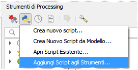

# download_ple_x_attributo_WFS_AdE

Ricerca e download di particelle (_per attributo_) usando il WFS dell Agenzia delle Entrate.

Questo algoritmo recupera dati catastali tramite il servizio WFS dell'Agenzia delle Entrate.

**FUNZIONALITÀ**:
- Ricerca particelle catastali per attributo (comune, foglio, particella)
- Supporta l'aggiunta a layer esistenti o la creazione di nuovi layer
- Calcola l'area della particella in metri quadri
- Esegue lo zoom automatico sull'ultima particella trovata

**PARAMETRI RICHIESTI:**
- Codice o Nome Comune: puoi inserire il codice catastale (es: M011) o il nome del comune (es: VILLAROSA)
- Se il nome del comune è presente per più particelle chiede di scrivere il codice catastale
- Numero foglio (es: 2) fa il padding a 4 cifre
- Numero particella (es: 2)

**ATTRIBUTI DEL LAYER:**
- NATIONALCADASTRALREFERENCE: codice identificativo completo
- ADMIN: codice comune
- SEZIONE: sezione censuaria
- FOGLIO: numero del foglio
- PARTICELLA: numero della particella
- AREA: superficie in metri quadri

Il risultato sarà un layer vettoriale con i poligoni delle particelle trovate.

## Come installare l'algoritmo nel Processing di QGIS

- L'algoritmo funziona solo da Processing di QGIS;
- Vai su Strumenti di Processing
- 'Aggiungi Script agli Strumenti...' dopo aver cliccato sull'Icona di Python:

- 

## Riferimenti

- [RNDT Scheda metadati](https://geodati.gov.it/geoportale/visualizzazione-metadati/scheda-metadati/?uuid=age:S_0000_ITALIA)
- [Cartografia catastale WFS](https://www.agenziaentrate.gov.it/portale/cartografia-catastale-wfs)
